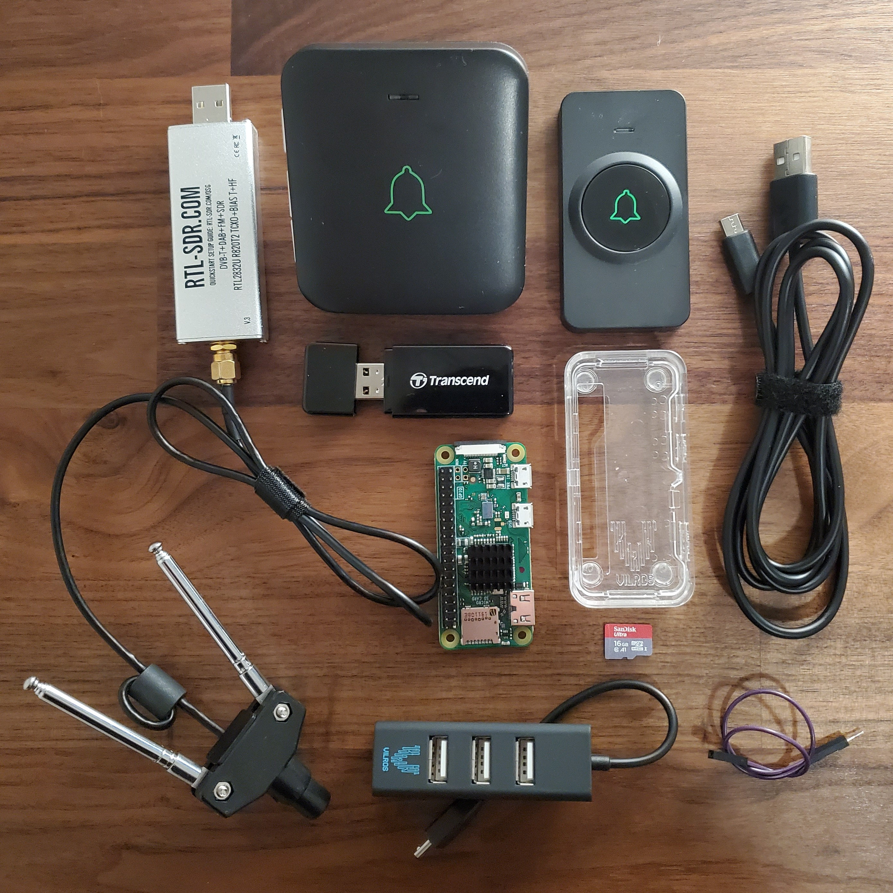
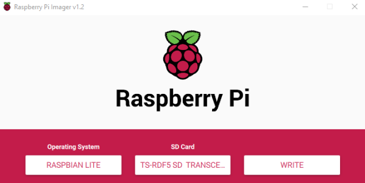
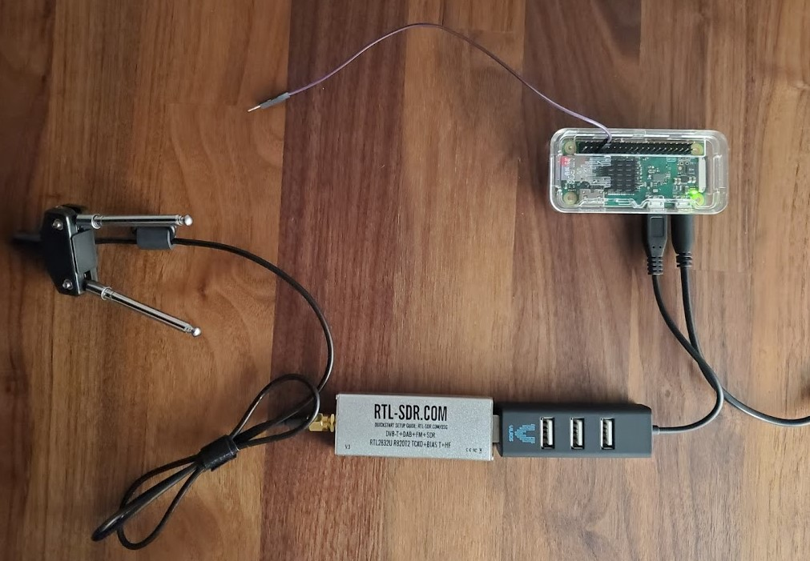
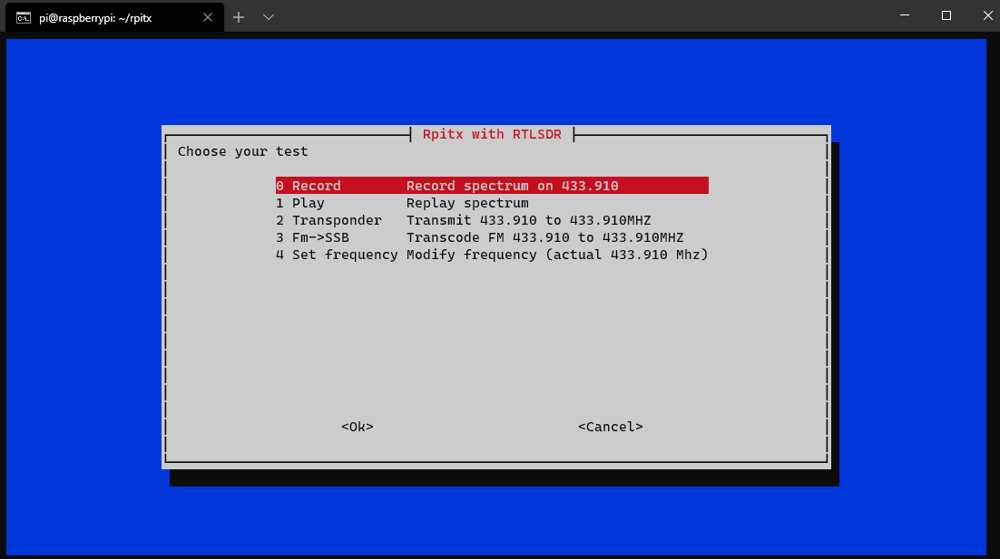
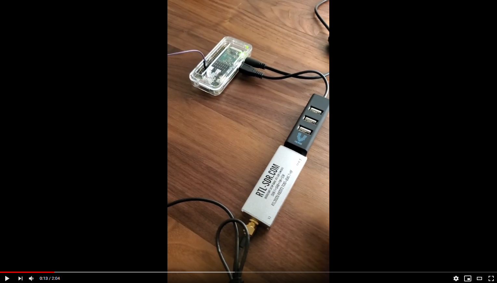

# Doorbell Replay Attack

In this project, I perform a replay attack on a wireless doorbell using an RTL-SDR, Raspberry Pi, and rpitx. This tutorial is an updated, comprehensive version of the original tutorial by RTL-SDR Blog ["Replay Attacks with an RTL-SDR, Raspberry Pi and RPiTX"](https://www.rtl-sdr.com/tutorial-replay-attacks-with-an-rtl-sdr-raspberry-pi-and-rpitx/). Do not use this tutorial for illegal activities.

## Table of Contents

- [Supplies](#supplies)
- [Walkthrough](#walkthrough)
  - [Install Raspbian to SD card](#install-raspbian-to-sd-card)
  - [Set up wireless networking and enable SSH](#set-up-wireless-networking-and-enable-ssh)
  - [Access command line remotely](#access-command-line-remotely)
  - [Install rpitx](#install-rpitx)
  - [Put the hardware together](#put-the-hardware-together)
  - [Find the remote's operating frequency](#find-the-remotes-operating-frequency)
  - [Perform the attack](#perform-the-attack)
- [Video demonstration](#video-demonstration)

## Supplies

- [RTL-SDR RTL2832U Dongle with Dipole Antenna Kit](https://www.amazon.com/dp/B011HVUEME)
- [AVANTEK Wireless Door Bell](https://www.amazon.com/dp/B076X3HRRF)
- [Raspberry Pi Zero W with GPIO Header](https://www.adafruit.com/product/3708)
- [MicroSD Card 32GB](https://www.amazon.com/dp/B073JWXGNT)
- [MicroSD Card Reader](https://www.amazon.com/dp/B009D79VH4)
- [USB A to Micro-USB Cable](https://www.adafruit.com/product/2185)
- [Micro-USB OTG Hub](https://www.adafruit.com/product/2991)
- [Raspberry Pi Zero Case](https://www.adafruit.com/product/3252)
- [Female/Male Jumper Wire](https://www.adafruit.com/product/1953)



These products are recommendations. If the Raspberry Pi does not have a GPIO header installed, you can use a short piece of solid-core wire and solder it in place. The MicroSD card reader is not required if your PC has an SD card slot and you have a MicroSD to SD card adapter. The MicroSD card can be as small as 4GB. The Raspberry Pi can be powered without a PC using a 5V 2.5A power supply with Micro-USB cable. The Raspberry Pi case is optional. Lastly, other models of the Raspberry Pi can be used. If the Raspberry Pi does not have wireless LAN connectivity you can plug it directly into a router. For a complete list of Raspberry Pi models compatible with rpitx, see: [F5OEO/rpitx "Hardware"](https://github.com/F5OEO/rpitx#hardware)

## Walkthrough

Raspbian is the official operating system (OS) for all models of the Raspberry Pi. The latest versions of Raspbian are based on Debian 10. For a complete list of OS images images for Raspberry Pi, see: [Raspberry Pi "Downloads"](https://www.raspberrypi.org/downloads/) The Raspberry Pi will be set up headless (without a monitor and keyboard) and will be accessed remotely from a PC. Installing Raspbian Lite, a version of Raspbian without a desktop environment, is recommended.

### Install Raspbian to SD card

1. Insert the SD card into the adapter or reader and into the PC.

1. Download and install [Raspberry Pi Imager](https://www.raspberrypi.org/downloads/).

1. Start Raspberry Pi Imager.

1. Click '*Choose OS*' and select '*Raspbian (other)*' then '*Raspbian Lite*'.

1. Click '*Choose SD card*' and select the SD card from the list. The next step will format the SD card.

   

1. Click '*Write*' and wait for the '*You may now remove the SD card from the reader*' message. This may take several minutes.

1. Close Raspberry Pi Imager.

### Set up wireless networking and enable SSH

Because the Raspberry Pi will be accessed remotely and will not have a monitor and keyboard connected to it, it must automatically connect to a wireless network and enable SSH (Secure Shell) when it boots.

1. Insert the SD card into the adapter or reader and into the PC.
1. Open a text editor.
1. Save a new file named `ssh` (without any extension) to the root of the SD card. The content of this file does not matter. When the Raspberry Pi boots, it will find this file, enable SSH, then delete the file.
1. Save a new file named `wpa_supplicant.conf` to the root of the SD card.

   ```conf
   ctrl_interface=DIR=/var/run/wpa_supplicant GROUP=netdev
   update_config=1
   country=<Insert 2 letter ISO 3166-1 country code here>

   network={
   ssid="<Name of your wireless LAN>"
   psk="<Password for your wireless LAN>"
   }
   ```

   Replace the placeholder values for the fields: *country*, *ssid*, *psk*. Note that some models of the Raspberry Pi do not support 5GHz networks. For a complete list of country codes, see: [Wikipedia "ISO 3166-1"](https://en.wikipedia.org/wiki/ISO_3166-1#Current_codes)
1. Close the text editor.
1. Remove the SD card from adapter or reader and insert it into the Raspberry Pi.

### Access command line remotely

The following instructions assume you are using a Windows 10 PC. For instructions on accessing the command line remote using a different OS, see: [Raspberry Pi "SSH (Secure Shell)"](https://www.raspberrypi.org/documentation/remote-access/ssh/)

1. Power on the Raspberry Pi by connecting it to your PC with the USB cable. Connect the cable into the Raspberry Pi port labeled '*PWR IN*'.
1. Start Command Prompt.
1. Connect to the following hostname and username. The default password is `raspberry`. (Changing the password from the default is recommended.)

   ```bash
   ssh pi@raspberrypi.local
   ```

1. If you see `pi@raspberrypi:~ $`, then you have logged in successfully.

   

### Install rpitx

[rpitx](https://github.com/F5OEO/rpitx) is a radio frequency transmitter for Raspberry Pi. This software will allow you to easily record and replay the signal broadcasted by the doorbell remote.

1. Perform an upgrade.

   ```bash
   sudo apt-get update
   sudo apt-get upgrade
   ```

   If you see the message '*Do you want to continue? [Y/n]*', confirm with `Y`.
1. Install the git package.

   ```bash
   sudo apt-get install git
   ```

1. Clone the rpitx repository.

   ```bash
   git clone https://github.com/F5OEO/rpitx.git
   ```

1. Install rpitx using the `install.sh` script.

   ```bash
   cd rpitx
   ./install.sh
   ```

   When you see the following prompt '*In order to run properly, rpitx needs to modify /boot/config.txt. Are you sure? (y/n)*', confirm with `y`. Wait for the '*Installation completed*' message. This may take several minutes.

1. Power off the Raspberry Pi.

   ```bash
   sudo shutdown now
   ```

### Put the hardware together

Now that you have remote access to the Raspberry Pi's command line and have the necessary software installed, you can move onto the hardware.

1. Disconnect the Raspberry Pi from your PC.
1. Plug the USB hub into the Raspberry Pi's Micro-USB port labeled '*USB*'.
1. Plug the RTL-SDR RTL2832U dongle into the USB hub.
1. Plug the female end of the jumper wire onto the Raspberry Pi's GPIO Pin 4. The male end of the jumper wire is not plugged into anything. This jumper wire will act as the antenna for transmitting.

   

   <sup>Image by <https://pinout.xyz></sup>

   

1. Plug the wireless doorbell receiver into an outlet.

### Find the remote's operating frequency

You will need to find the frequency the doorbell remote broadcasts on, most likely somewhere between 433.050 MHz and 434.790 MHz. The [LPD433](https://en.wikipedia.org/wiki/LPD433) (low power device 433 MHz) band is commonly used in keyless entry remotes, garage door openers, and other short-range low-power devices. You may be able to find the operating frequency with a Google search or a [searchable FCC ID database](https://fccid.io/). If you are unable to find the operating frequency, consider using SDR software such as [SDR#](https://airspy.com/download/) to identify it in a spectrum analyzer. For a list of RTL-SDR supported software, see: [RTL-SDR Blog "The Big List of RTL-SDR Supported Software"](https://www.rtl-sdr.com/big-list-rtl-sdr-supported-software/) For the doorbell used in this demonstration 433.910 MHz worked best.

### Perform the attack

Now that all the setup is done, you can perform the replay attack.

1. Power on the Raspberry Pi.
1. SSH into the Raspberry Pi.
1. Change the current working directory to the rpitx directory and open the RTL menu using the `rtlmenu.sh` script.

   ```bash
   cd rpitx
   ./rtlmenu.sh
   ```

1. For the receive frequency, enter the operating frequency. Press Enter.
1. For the input gain, enter the default value. Press Enter.
1. For the transmit frequency, enter the operating frequency again. Press Enter. You should see a list of tests.

   

1. With the '*Record*' option selected, press Enter. Immediately ring the doorbell using its remote. Press Enter to stop the recording.
1. With the '*Play*' option selected, press Enter. The recording will be replayed and the doorbell should ring without having used its remote!

If the doorbell does not ring after replaying the recording, try adjusting the input gain.

## Video demonstration

[YouTube "Doorbell Replay Attack Using an RTL-SDR and Raspbery Pi"](https://www.youtube.com/watch?v=oTkLvH5QD3M)


